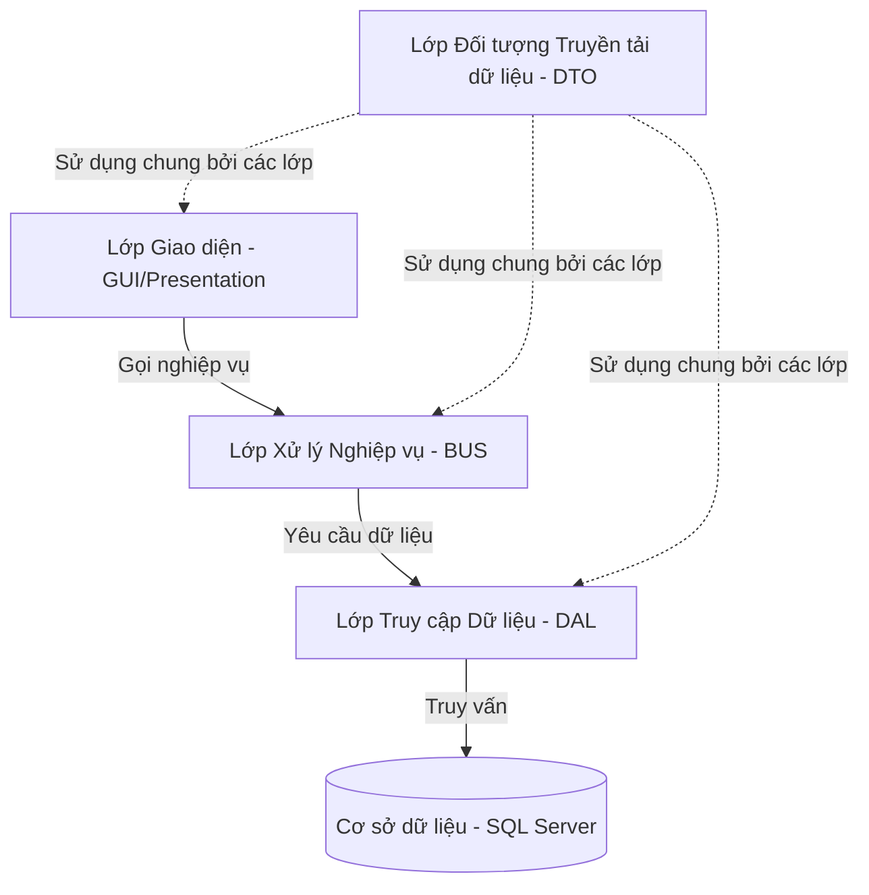

# ✈️ SkyBlue Airline - Hệ thống Quản lý Hàng không Toàn diện

> **SkyBlue Airline** là một giải pháp quản lý hàng không hiện đại, bảo mật và hiệu quả dành cho nền tảng Windows. Ứng dụng mang đến trải nghiệm điều hành bay trực quan, quản lý vé thông minh, tự động hóa quy trình phân ca phi hành đoàn và tối ưu hóa doanh thu thông qua hệ thống báo cáo phân tích mạnh mẽ.

🔗 **Trang web chính thức & Tải ứng dụng:** [https://skyblue-airline.netlify.app/](https://skyblue-airline.netlify.app/)
*(Tại đây bạn có thể tải xuống bộ cài đặt chính thức `SkyBlueAirline_Setup_v1.0.5.exe` dành cho Windows)*

---

## 🗺️ Bản đồ Mục lục
- [✈️ SkyBlue Airline - Hệ thống Quản lý Hàng không Toàn diện](#️-skyblue-airline---hệ-thống-quản-lý-hàng-không-toàn-diện)
  - [🗺️ Bản đồ Mục lục](#️-bản-đồ-mục-lục)
  - [🌟 Tính năng Nổi bật](#-tính-năng-nổi-bật)
  - [📐 Kiến trúc Dự án (3-Layer Architecture)](#-kiến-trúc-dự-án-3-layer-architecture)
  - [💻 Công nghệ Sử dụng](#-công-nghệ-sử-dụng)
  - [📁 Cấu trúc Thư mục Dự án](#-cấu-trúc-thư-mục-dự-án)
  - [🚀 Hướng dẫn Cài đặt & Khởi chạy](#-hướng-dẫn-cài-đặt--khởi-chạy)
    - [Dành cho Người dùng cuối](#dành-cho-người-dùng-cuối)
    - [Dành cho Lập trình viên (Phát triển dự án)](#dành-cho-lập-trình-viên-phát-triển-dự-án)
  - [📞 Thông tin Hỗ trợ & Liên hệ](#-thông-tin-hỗ-trợ--liên-hệ)

---

## 🌟 Tính năng Nổi bật

Hệ thống được phát triển với đầy đủ các phân hệ chức năng chuyên sâu, phục vụ tối đa nhu cầu vận hành của một hãng hàng không thực tế:

| Phân hệ chức năng | Mô tả chi tiết |
| :--- | :--- |
| **🏠 Trang chủ & Tổng quan** | Giao diện điều khiển (Dashboard) trực quan hiển thị nhanh các thống kê quan trọng, biểu đồ và phím tắt nhanh đến các tính năng khác. |
| **📅 Quản lý Lịch bay** | Lên lịch trình bay, điểm xuất phát/điểm đến, thời gian bay, gán tàu bay tự động và tối ưu hóa giờ bay để hạn chế xung đột. |
| **🧭 Tuyến bay & Đội bay** | Quản lý mạng lưới đường bay toàn cầu, thông tin chi tiết từng máy bay trong đội bay và thiết lập thông số kỹ thuật. |
| **🛋️ Cấu hình Hạng ghế** | Thiết lập các hạng vé (Thương gia, Phổ thông,...), định hình giá vé cơ bản và các quy tắc áp dụng phụ phí linh hoạt. |
| **🔍 Tìm kiếm Chuyến bay** | Bộ lọc tìm kiếm thông minh giúp tra cứu nhanh chuyến bay theo địa điểm, thời gian, số hiệu bay chỉ trong vài mili-giây. |
| **🎟️ Đặt vé & Chọn ghế** | Quy trình đặt vé hiện đại với **Sơ đồ chọn ghế trực quan (Seat Selection Map)** theo thời gian thực, đảm bảo không trùng ghế. |
| **💳 Quản lý & Xuất vé** | Theo dõi trạng thái vé, hủy vé, thay đổi thông tin và **tự động hóa quy trình xuất/in vé** PDF chất lượng cao. |
| **🍱 Quản lý Dịch vụ** | Quản lý dịch vụ đi kèm như hành lý ký gửi, suất ăn trên máy bay, phòng chờ thương gia nhằm tăng doanh thu phụ trợ. |
| **👥 Quản lý Nhân sự** | Phân công phi công, tiếp viên hàng không vào phi hành đoàn của từng chuyến bay, quản lý hồ sơ nhân viên và ca trực. |
| **📧 CSKH & Gửi Email** | Dịch vụ gửi email thông báo tự động (thông tin đặt vé, thay đổi lịch bay) và tiếp nhận ý kiến phản hồi của khách hàng. |
| **📊 Báo cáo & Thống kê** | Trực quan hóa doanh thu, tỷ lệ lấp đầy ghế (occupancy rate) qua biểu đồ cột/đường chuyên nghiệp phục vụ ban quản trị. |
| **🔒 Lịch sử Hệ thống** | Ghi nhận chi tiết lịch sử hoạt động (Audit Log) của nhân viên để tăng tính minh bạch và bảo mật dữ liệu. |

---

## 📐 Kiến trúc Dự án (3-Layer Architecture)

Dự án tuân thủ nghiêm ngặt mô hình kiến trúc **3 lớp (3-Layer Architecture)** chuẩn hóa trong phát triển phần mềm doanh nghiệp, giúp hệ thống có tính độc lập cao, dễ bảo trì và mở rộng:



- **Presentation Layer (GUI)**: Giao diện người dùng thiết kế bằng WPF (XAML), xử lý tương tác trực tiếp và hiển thị dữ liệu đến người dùng.
- **Business Logic Layer (BUS)**: Tiếp nhận các yêu cầu từ GUI, thực hiện kiểm tra tính hợp lệ của nghiệp vụ, áp dụng các quy tắc hàng không trước khi đẩy xuống cơ sở dữ liệu.
- **Data Access Layer (DAL)**: Chịu trách nhiệm kết nối và thực hiện các câu lệnh truy vấn dữ liệu trực tiếp với SQL Server. Để tối ưu hóa hiệu năng, lớp này tận dụng triệt để các **Stored Procedures** trên Database.
- **Data Transfer Object (DTO)**: Chứa các cấu trúc lớp mô hình hóa dữ liệu (Model) dùng chung để truyền tải dữ liệu giữa các Layer.

---

## 💻 Công nghệ Sử dụng

Hệ thống được phát triển dựa trên các công nghệ tiên tiến nhằm đảm bảo tính thẩm mỹ vượt trội và hiệu năng cao nhất:

- **Công nghệ cốt lõi:** C#, .NET Framework / .NET Core, WPF (Windows Presentation Foundation).
- **Giao diện & UI/UX:**
  - **Material Design in XAML Toolkit:** Mang lại giao diện hiện đại theo phong cách Material, các hiệu ứng chuyển động mượt mà và hệ thống thông báo nội bộ cực kỳ cao cấp.
  - **LiveCharts:** Thư viện biểu đồ động hỗ trợ vẽ báo cáo doanh thu trực quan, hiện đại.
  - Phông chữ hiện đại: `Outfit` (Google Fonts) kết hợp phong cách thiết kế Glassmorphism trên Landing Page.
- **Hệ cơ sở dữ liệu:** Microsoft SQL Server (sử dụng Stored Procedure tăng tốc truy vấn tìm kiếm, lọc và thống kê).
- **Thông báo & Email:** MailKit & MimeKit để gửi email thông báo tự động cho khách hàng.
- **Web Landing Page:** HTML5, CSS3 (Vanilla), JavaScript, lưu trữ trên Netlify phục vụ tải ứng dụng.

---

## 📁 Cấu trúc Thư mục Dự án

```text
FlightManagement_Project_Update/
├── FlightManagement/                      # Thư mục chứa mã nguồn ứng dụng WPF Desktop
│   ├── FlightManagement.sln               # File Solution của Visual Studio
│   ├── FlightManagement/                  # Dự án chính (GUI, Assets, App.xaml)
│   │   ├── UserControls/                  # Các UserControl đại diện cho từng phân hệ chức năng
│   │   ├── Services/                      # Các dịch vụ dùng chung (Email Notification, PDF export,...)
│   │   └── Helpers/                       # Các hàm bổ trợ
│   ├── BUS/                               # Business Logic Layer (Lớp Nghiệp vụ)
│   ├── DAL/                               # Data Access Layer (Lớp Truy xuất dữ liệu)
│   ├── DTO/                               # Data Transfer Object (Lớp Đối tượng dữ liệu)
│   ├── Database/                          # Chứa kịch bản SQL và file tạo cơ sở dữ liệu
│   └── PrintTicket/                       # Phân hệ/Thư viện xử lý in vé chuyên dụng
│
└── Web/                                   # Thư mục mã nguồn trang giới thiệu & tải ứng dụng
    ├── index.html                         # Giao diện Landing Page (Glassmorphism design)
    └── SkyBlueAirline_Setup_v1.0.5.exe    # File cài đặt chính thức của ứng dụng Windows
```

---

## 🚀 Hướng dẫn Cài đặt & Khởi chạy

### Dành cho Người dùng cuối
1. Truy cập trang web: [https://skyblue-airline.netlify.app/](https://skyblue-airline.netlify.app/)
2. Nhấp vào nút **Tải xuống** (Download) để tải về tệp cài đặt `SkyBlueAirline_Setup_v1.0.5.exe`.
3. Mở tệp cài đặt vừa tải xuống và tiến hành cài đặt ứng dụng theo hướng dẫn trên màn hình.
4. Mở ứng dụng từ màn hình Desktop và bắt đầu trải nghiệm!

### Dành cho Lập trình viên (Phát triển dự án)
**Yêu cầu hệ thống:**
- Microsoft Visual Studio 2022 trở lên.
- .NET SDK tương thích.
- Microsoft SQL Server.

**Các bước cài đặt:**
1. **Clone dự án:**
   ```bash
   git clone https://github.com/truongquy2k6/skyblue-airlines-system.git
   ```
2. **Thiết lập Cơ sở dữ liệu:**
   - Mở SQL Server Management Studio (SSMS).
   - Mở file kịch bản SQL nằm trong thư mục `FlightManagement/Database/` và chạy để tạo database cùng các Stored Procedure cần thiết.
3. **Cấu hình chuỗi kết nối (Connection String):**
   - Cập nhật Connection String trong file cấu hình dự án (`App.config` hoặc cấu hình tương đương) để trỏ đến cơ sở dữ liệu SQL Server của bạn.
4. **Mở và Chạy dự án:**
   - Khởi động Visual Studio và mở file `FlightManagement.sln`.
   - Restore các gói NuGet nếu cần thiết.
   - Nhấn **F5** (hoặc nút **Start**) để biên dịch và chạy thử ứng dụng ở môi trường phát triển (Debug mode).

---

## 📞 Thông tin Hỗ trợ & Liên hệ

Nếu bạn có bất kỳ câu hỏi nào liên quan đến ứng dụng hoặc kỹ thuật, vui lòng liên hệ đội ngũ phát triển của chúng tôi:

* 📧 **Email Hỗ trợ:** truongquy2k6@gmail.com
* 🌐 **Website Dự án:** [skyblue-airline.netlify.app](https://skyblue-airline.netlify.app/)

---
*© 2026 SkyBlue Airline. Bản quyền phần mềm thuộc về dự án phát triển SkyBlue Airline. Ghi rõ nguồn khi chia sẻ.*
